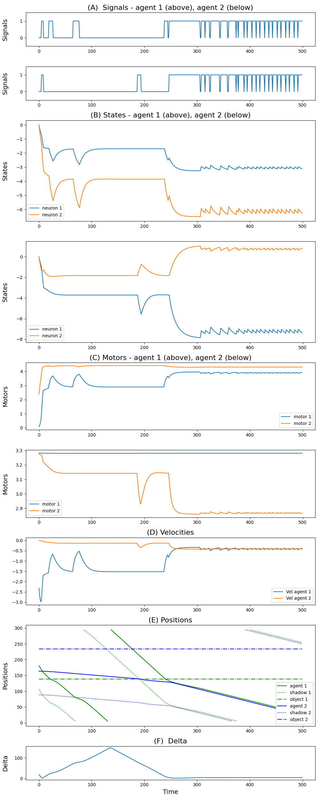

# PCE Simulation

## Table of Contents
1. [Introduction](#Introduction)
2. [Quick Start](#Quick-Start)
3. [Tutorial](#Tutorial)
4. [Reproducing Published Results](#Reproducing-Published-Results)

## Introduction
This is an open-sourced implementation of simulation-based Perceptual Crossing Experiment (PCE), in the hope of facilitating the process of reproducing and extending simulation results.

## Installation

1. All experiments were done using `Python 3.7.3` installed (try `python3 -V`). Later version of Python should also work, but we only guarantee reproducibility with `Python 3.7.3`.
2. Clone the `pce-simulation` package
    ```
    git clone --branch 1.0.0 https://github.com/oist/ecsu-cnru-pce-simulation pce-simulation
    ```
3. Create and activate python virtual environment, upgrade pip and install requirements.
    ```
    cd pce-simulation
    python3 -m venv .venv
    source .venv/bin/activate
    python -m pip install --upgrade pip
    pip install -r requirements.txt
    ```

## Quick start
### Run simulation

To create a new simulation experiment run `pce.main`.\
Use `--help` to see the list of arguments:
```
python -m pce.main --help
```

### Analyzing results

In order to inspect the result of a simulation experiment saved in a specifc directory, run `pce.run_from_dir`
```
python -m pce.run_from_dir --dir DIR
```

Use `--help` to see the list of arguments:
```
python -m pce.run_from_dir --help
```

Most relevant args are:
```
--dir DIR               Directory path
--gen GEB               Generation number to load. Defaults to the last one.
--genotype_idx IDX      Index (0-based) of agent in population to load. Defaults to 0 (best agent).
--trial TRIAL           Number (1-based) of the trial (defaults to the worst performance)
--viz                   Run visualization of the selected trial
--mp4                   Save visualization to video
--plot                  Run plots of the selected trial
```

## Tutorial

### Python Environment

Alaways remember to activate the python environemnt first
```
source .venv/bin/activate
```

Make sure that the cosole prompt has the `(.venv)` prefix.
### Run a simulation experiment

The following code runs a simulation experiment: 

```
python -m pce.main --dir ./tutorial --evo_seed 1 --num_pop 2 --pop_size 24 --num_agents 2 --noshuffle --num_neurons 2 --max_gen 100 --cores 5
```

If the output folder (in this case `tutorial`) does not exist, the program will create one for you. If it already exists, it will create (or overwrite) a directory inside it with a name which reflects the list of main arguments being used and a further directory with the seed (in this case `tutorial/pce_overlapping_min_2p_2a_2n_2o_noshuffle/seed_001`).

The command parameters can be explained as follows:

- `2 agents` with `2 neurons` each, interact on a PCE game.  We set the evolutionary part of the experiment (using the `pyevolver` library) to use `2 populations` of `24 agents` and `100 generations`.
- We use `evo_seed 1`. This is used **only** in the **evolutionary part of the simulation**, e.g, for determining the initial genotype of the population, and the mutations throughout the generations.
- We use the arguemnt `--noshuffle` which means that agents in the two populations are **not randomly shuffled** before being paired in the simulation. This means that agents in the two populations are always pairwise aligned. Although most agents undergo mutation and crossover during evolution, at least 1 agent in each population (the first and best performing one) is part of the "elite" and will be identical in the following generation.
**This ensures that best performance across subsequent generations will stay identical or will increase (monotonically non-decreasing).**
- Finally `5 cores` are used for the experiemnt.

Other evolutionary and simulation arguments are not specified, therefore the default ones are used. In particular:
   - `--perf_func OVERLAPPING_STEPS`: the performance is based on the number of overlapping steps (percentage of the simulation steps where the two agents overlap).
   - `--agg_func MIN`: among the perfomances of the various trials (10 by default) the MINIMUM value is used as the overall performance of the experiment between two agents.
   - `env_length 300`: the environment length is 300
   - `num_objects 2`: the simultation uses 2 objects
   - `agent_width 4`: the agents (and object) width is 4 units
   - `shadow_delta env_length/4`: shadows are 75 units of distance from their respective agents
   - `alternate_sides False`: by default agents are placed on opposite side of the 1-d space across trials in a fixed arrangemnt: the first agent (GREEN in visualizations) always faced outwards, whereas the second (BLUE) always faces inwards.
   - `objects_facing_agents True`: by default the 2 object are positioned facing their respective agents: one outside the environment facing the first agent (GREEN) and one inside facing the second agent (BLUE).

In addition, it is important to mention that currently, in each trial, **agents and objects are positioned randomly** (uniformally) within the environment (e.g., first agent positioned at 3 o'clock and the second at 6 o'clock). Also keep in mind that those positions are determined by a fixed `seed 0` and are identical for all agents and all generations. This seed cannot be changed when running the experiment (with `pce.main`), but can be modified when rerunning the experiment (with `pce.run_from_dir`) to ensure robustness of results (see `--sim_seed` below).

### Console Output

There are some information being printed in the output console.\
Initially a line specifies how many agents are part of the  `n_elite`, `n_mating`, and `n_filling` (see `pyevolver` library for more details).

```
n_elite, n_mating, n_filling:  1 23 0
```

Next, for each generation, the output of the best/worst/average/variance of the agents performance is displayed:
```
Generation   0: Best: 0.02600|0.02600, Worst: 0.00000|0.00000, Average: 0.01950|0.01950, Variance: 0.00006|0.00006
Generation   1: Best: 0.02600|0.02600, Worst: 0.00000|0.00000, Average: 0.02000|0.02000, Variance: 0.00005|0.00005
Generation   2: Best: 0.02600|0.02600, Worst: 0.00000|0.00000, Average: 0.01908|0.01908, Variance: 0.00007|0.00007
Generation   3: Best: 0.02600|0.02600, Worst: 0.00000|0.00000, Average: 0.01900|0.01900, Variance: 0.00006|0.00006
...
Generation  98: Best: 0.46400|0.46400, Worst: 0.00000|0.00000, Average: 0.03700|0.03700, Variance: 0.00799|0.00799
Generation  99: Best: 0.46400|0.46400, Worst: 0.00000|0.00000, Average: 0.03775|0.03775, Variance: 0.00794|0.00794
Generation 100: Best: 0.46400|0.46400, Worst: 0.00000|0.00000, Average: 0.03775|0.03775, Variance: 0.00800|0.00800
```

We can notice that the performance pairs are identical, because in the simulation the paired agents interact together for all trials and received the same performance.
After 100 generations the experiment produces an agent pair (the first agents in each population) achieving a performance of `~0.46`, meaning that in the worse trial, in about `46%` of the simulation steps the two agents overlap.

### Files in Output

In the output directory we find `10` evolution files `evo_xxx.json`, where `xxx` ranges between `000` (very first random population initialized with random genotipe) and `100` (last generation).\
Each evolution file contains information with the parameters related to the evolutionary part of the experiment, such as `population_size`, `num_populations`, the genotype of the agents (`population`), the agents performances (`performances`).

In addition, we find the file `simulation.json` which list all arguments necessary to replicate the simulation settings of this experiments, such as number of neurons (`num_neurons`), trials (`num_trials`) and simulation steps (`num_steps`).

### Analyzing results

If we want to rerun the simulation we just need to run:
```
python -m pce.run_from_dir --dir ./tutorial/pce_overlapping_min_2p_2a_2n_2o_noshuffle/seed_001
```

This would output the following:
```
Agent signature: TDgOt
Performance (in json): 0.464
Performance recomputed: 0.464
Trials Performances: [0.582, 0.464, 0.582, 0.7, 0.69, 0.81, 0.652, 0.504, 0.832, 0.55]
Agent(s) signature(s): ['TDgOt', 'jzvyY']
Non flat neurons: [2 2]
Performance of selected trial (2/10): 0.464
```

We can see that the recomputed performance (`0.464`) is the same one listed above (next to generation 100). This is the performance of the 2nd trial, being the worst one (remember that by defualt we had `--agg_func MIN`).

We can change the simulation seed (determining the positions of objects and agents across trials) with the `--sim_seed` argument:
```
python -m pce.run_from_dir --dir ./tutorial/pce_overlapping_min_2p_2a_2n_2o_noshuffle/seed_001 --sim_seed 123
```
which procuces the following output:
```
Overriding sim_seed from 0 to 123
Agent signature: TDgOt
Performance (in json): 0.464
Performance recomputed: 0.456
Trials Performances: [0.764, 0.656, 0.818, 0.804, 0.456, 0.68, 0.782, 0.654, 0.508, 0.504]
Agent(s) signature(s): ['TDgOt', 'jzvyY']
Non flat neurons: [2 2]
Performance of selected trial (5/10): 0.456
```

We can see that the overall (worse) performance is slighly lower than before, but across the 10 new trials there are higher performances.

### Visualizing results

To see a visualization of this trial add the argument `--viz` (or `--mp4` if you want to save the file):
```
python -m pce.run_from_dir --dir ./tutorial/pce_overlapping_min_2p_2a_2n_2o_noshuffle/seed_001 --viz
```


In `viz` mode you can press `P` for pausing/unpausing the simulation. While the simulation is pause you can move manually to previous/next steps with the `left` and `right` arrows.

In order to see the visualization of the best trial between these two agents, (i.e., the 7th one), use `--trial 3` or `--trial best`:
```
python -m pce.run_from_dir --dir ./tutorial/pce_overlapping_min_2p_2a_2n_2o_noshuffle/seed_001 --trial best --viz
```


### Plotting results

In order to see a set of plots use the '--plot' argument:
```
python -m pce.run_from_dir --dir ./tutorial/pce_overlapping_min_2p_2a_2n_2o_noshuffle/seed_001 --plot
```

This will output the file `plot_all.png` in the current directory.


### Ghost simulation

One advanced method for analyzing the experiment is to set one agent in "ghost" mode. This means that one of the agents, intead of interacting with the other agent, "plays back" the movement of itself in a previously recorded simulation. This allows us to investigate scenarios where the behavior of an agent is realistic (identical to the agent interacting in the task) but without being "sensitive" to possible pertubation of the new simulation (e.g., change of the initial position of the other agent).

In order to run the simulation with the first agent being the 'ghost' we run:
```
python -m pce.run_from_dir --dir ./tutorial/pce_overlapping_min_2p_2a_2n_2o_noshuffle/seed_001 --ghost_index 0
```

This will output:
```
Original performance (without ghost and overriding params): 0.402
Agent signature: TDgOt
Performance (in json): 0.464
Performance recomputed: 0.464
Trials Performances: [0.582, 0.464, 0.582, 0.7, 0.69, 0.81, 0.652, 0.504, 0.832, 0.55]
Agent(s) signature(s): ['TDgOt', 'jzvyY']
Non flat neurons: [2 2]
Performance of selected trial (2/10): 0.464
```

We can notice that the results are identical to the original one. This is because the 'ghost_agent' has been placed in a new simulation which is in fact identical to the original one, resulting in the same results.

In order to use the ghost mode in an effective way, we would need to perturbate the new simulation, for instance, changing the initial position of the other agent. We can do that overriding the seed of the simulation in the ghost mode using the `--sim_seed` argument.
This runs the original simulation with the original `seed 0` (without overriding parameters) and saving all position of the ghost agent. Next, a new simulation is run where the ghost agent positions are played back, whereas the other agent is placed in a different position and behave differently from the original simulation, while responding to the behaviour of the ghost agent.

To run the ghost simulation with "pertubation" run the following:
```
python -m pce.run_from_dir --dir ./tutorial/pce_overlapping_min_2p_2a_2n_2o_noshuffle/seed_001 --sim_seed 123 --ghost_index 0 --trial 1 --viz
```

This will output:
```
Overriding sim_seed from 0 to 123
Original performance (without ghost and overriding params): 0.464
Agent signature: TDgOt
Performance (in json): 0.464
Performance recomputed: 0.0
Trials Performances: [0.014, 0.508, 0.168, 0.336, 0.022, 0.006, 0.014, 0.012, 0.0, 0.012]
Agent(s) signature(s): ['TDgOt', 'jzvyY']
Non flat neurons: [2 2]
Performance of selected trial (1/10): 0.014
Visualizing trial 1/10
```

We can notice that all but 3 trials have a very low performance (less than 0.1).

When visualizing the first trial we notice that the green agent (ghost) has the same identical behaviour as in the original simulation. However, the blue agent (non-ghost) get stuck on the shadow of the green agent.


## Reproducing Published Results

This secion describes the details to reproduce the results contained in the following publication (under revision): 

*2022, Federico Sangati and Rui Fukushima, PCE Simulation Toolkit: A Platform for Perceptual Crossing Experiment Research*

### Steps to reproduce the results:

1. Follow the [Installation](#Installation) procedure above.
2. Checkout version 1.0.0
    ```
    git checkout 1.0.0
    ```
3. If you want to **run the simulations on a cluster**, execute the following 3 scritps in the `slurm` directory :
   - `sbatch distance_min_1p_2a_3n_self.slurm` (Case Study 1, 3 neurons, clone case)
   - `sbatch distance_min_1p_2a_4n_self.slurm` (Case Study 1, 4 neurons, clone case)
   - `sbatch distance_min_2p_2a_1n_aligned.slurm` (Case Study 2, 1 neuron, 2 aligned populations)

   Each sbatch file will run an array of 100 simulations (100 random seeds from `1` to `100`). The output directories will be respectively: 
   - `pce_distance_min_1p_2a_3n_2o_self`
   - `pce_distance_min_1p_2a_4n_2o_self`
   - `pce_distance_min_2p_2a_1n_2o_noshuffle`
   
   Our code has been run on 128 `AMD Epyc` CPUs nodes [cluster at OIST](https://groups.oist.jp/scs/deigo) running `CentOS 8`.
4. Alternatively, if you want to **run the simulation on a personal computer** on the seeds considered in the publication, run the `python3` command included in any slurm file above, setting `seed` and `output directory` and `cores` (number of cores) appropriately:
   - `python3 -m pce.main --evo_seed 24 --dir output_dir --num_pop 1 --num_agents 2 --pop_size 48 --num_neurons 3 --perf_func DISTANCE --agg_func MIN --num_steps 2000 --num_trials 100 --max_gen 2000 --self_pairing --cores 8`
   - `python3 -m pce.main --evo_seed 23 --dir output_dir --num_pop 1 --num_agents 2 --pop_size 48 --num_neurons 4 --perf_func DISTANCE --agg_func MIN --num_steps 2000 --num_trials 100 --max_gen 2000 --self_pairing --cores 8`
   - `python3 -m pce.main --evo_seed 3 --dir output_dir --num_pop 2 --num_agents 2 --pop_size 48 --num_neurons 1 --perf_func DISTANCE --agg_func MIN --num_steps 2000 --num_trials 100 --max_gen 2000 --noshuffle --cores 8`
5. The videos of the 3 simulations discussed in the paper are in the `pub_data` folder:
   - 
   - 
   - 
