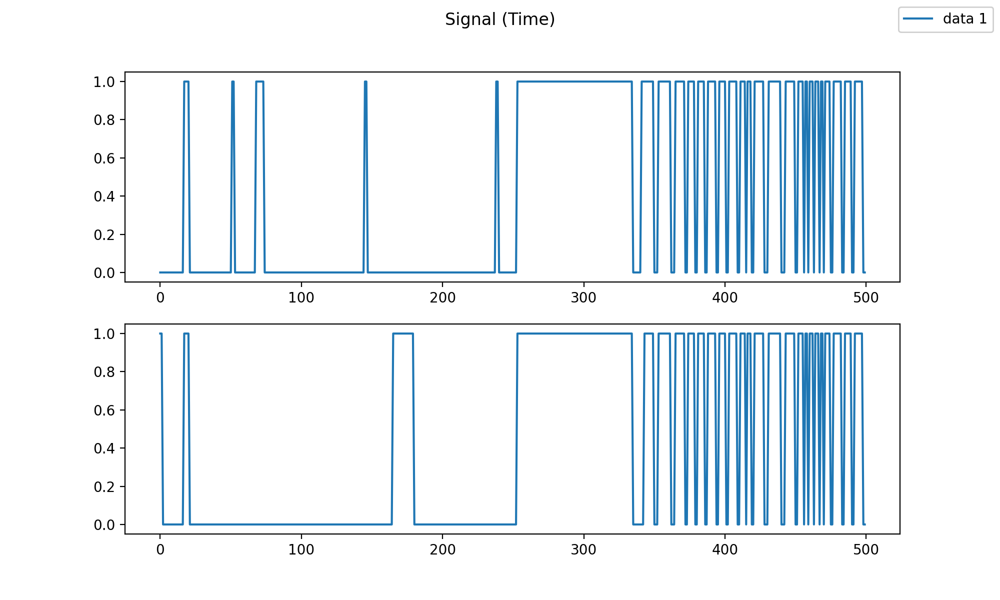

# PCE Simulation

## Installation

1. Make sure you have `Python 3.7.3` installed (try `python3 -V`).
2. Clone the `pce-simulation` package
    ```
    git clone git@gitlab.com:oist-ecsu/pce-simulation.git
    ```
3. Create and activate python virtual environment, upgrade pip and install requirements.
    ```
    cd pce-simulation
    python3 -m venv .venv
    source .venv/bin/activate
    python -m pip install --upgrade pip
    pip install -r requirements.txt
    ```

## Run simulation

To create a new simulation experiment run `pce.main`.\
See help for list of arguments.
```
python -m pce.main --help
```

## Analyzing results

In order to inspect the result of a simulation experiment saved in a specifc directory, run `pce.run_from_dir`
```
python -m pce.run_from_dir --dir DIR
```

See help for list of arguments.
```
python -m pce.run_from_dir --help
```

Most relevant args are:
```
--dir DIR               Directory path
--gen GEB               Generation number to load. Defaults to the last one.
--genotype_idx IDX      Index (0-based) of agent in population to load. Defaults to 0 (best agent).
--trial TRIAL           Number (1-based) of the trial (defaults to the worst performance)
--viz                   Run visualization of the selected trial
--plot                  Run plots of the selected trial
```

## Example

The following code runs a simulation experiment with `2 populations` of `24 agents` with `2 neurons` for `100 generations` on `5 cores`.

```
python -m pce.main --dir ./data/test --seed 1 --num_pop 2 --pop_size 24 --num_agents 2 --noshuffle --num_neurons 2 --max_gen 100 --cores 5
```

Note that we used the arguemnt `--noshuffle` which means that agents in the two populations are **not randomly shuffled** before being paired in the simulation. This means that agents in the two populations are always pairwise aligned. Although most agents undergo mutation and crossover during evolution, at least 1 agent in each population (the best performing one) is part of the "elite" and will be identical in the following generation.
**This ensures that best performance across generation will stay identical or will increase (non decreasing).** 

Note also that other evolutionary and simulation arguments are not specified, therefore the default ones are used.\
In particular:
   - `--perf_func OVERLAPPING_STEPS`: the performance is based on the number of overlapping steps (percentage of the simulation steps where the two agents overlap).
   - `--agg_func MIN`: among the perfomances of the various trials (10 by default) the MINIMUM value is used as the overall performance of the experiment between two agents.

### Console Output

There are some information being printed in the output console.\
Initially a line specifies how many agents are part of the  `n_elite`, `n_mating`, and `n_filling` (see `pyevolver` library for more details).

```
n_elite, n_mating, n_filling:  1 23 0
```

Next, for each generation, the output of the best/worst/average/variance of the agents performance is displayed:
```
Generation   0: Best: 0.02600|0.02600, Worst: 0.00000|0.00000, Average: 0.02067|0.02067, Variance: 0.00005|0.00005
Generation   1: Best: 0.02600|0.02600, Worst: 0.00000|0.00000, Average: 0.01925|0.01925, Variance: 0.00006|0.00006
Generation   2: Best: 0.02800|0.02800, Worst: 0.00000|0.00000, Average: 0.02058|0.02058, Variance: 0.00006|0.00006
Generation   3: Best: 0.02800|0.02800, Worst: 0.00000|0.00000, Average: 0.02050|0.02050, Variance: 0.00007|0.00007
...
Generation  98: Best: 0.40200|0.40200, Worst: 0.00000|0.00000, Average: 0.04033|0.04033, Variance: 0.00677|0.00677
Generation  99: Best: 0.40200|0.40200, Worst: 0.00000|0.00000, Average: 0.03717|0.03717, Variance: 0.00582|0.00582
Generation 100: Best: 0.40200|0.40200, Worst: 0.00000|0.00000, Average: 0.03592|0.03592, Variance: 0.00586|0.00586
```

We can notice that the performance pairs are identical, because in the simulation the paired agents interact together for all trials and received the same performance.
After 100 generations the experiment produces an agent pair (the first agents in each population) achieving a performance of `~0.40`, meaning that in the worse trial, in about `40%` of the simulation steps the two agents overlap.

### Directory Output

Assuming the path `./data/test` already existed, this command creates a new folder inside it is created with the experiment results:\
`./data/test/pce_overlapping_min_2p_2a_2n_2o_noshuffle/seed_001`.\
If `./data/test` did not exist, it will be created (but no directory with automatic name mentioning the main arguments being used will be created under it).

In this directory we find `10` evolution files `evo_xxx.json`, where `xxx` ranges between `000` (very first random population initialized with random genotipe) and `100` (last generation).\
Each evolution file contains information with the parameters related to the evolutionary part of the experiment, such as `population_size`, `num_populations`, the genotype of the agents (`population`), the agents performances (`performances`).

In addition, we find the file `simulation.json` which list all arguments necessary to replicate the simulation settings of this experiments, such as number of neurons (`num_neurons`), trials (`num_trials`) and simulation steps (`num_steps`).

### Analyzing results

If we want to rerun the simulation we just need to run:
```
python -m pce.run_from_dir --dir ./data/test/pce_overlapping_min_2p_2a_2n_2o_noshuffle/seed_001
```

This would output the following:
```
Agent signature: Xbks7
Performance (in json): 0.402
Performance recomputed: 0.402
Trials Performances: [0.488, 0.496, 0.582, 0.558, 0.518, 0.402, 0.648, 0.526, 0.416, 0.568]
Agent(s) signature(s): ['Xbks7', 'ACjQV']
Non flat neurons: [1 1]
Performance of select trial (6/10): 0.402
```

We can see that the recomputed performance (`0.402`) is the same one listed above (next to generation 100). This is the performance of the 6th trial, being the worst one (remember that by defualt we had `--agg_func MIN`).

To see a visualization of this trial add the argument `--viz` (or `--mp4` if you want to save the file):
```
python -m pce.run_from_dir --dir ./data/test/pce_overlapping_min_2p_2a_2n_2o_noshuffle/seed_001 --viz
```


In order see the visualization of the best trial between these two agents, (i.e., the 7th one), use `--trial 7` or `--trial best`:
```
python -m pce.run_from_dir --dir ./data/test/pce_overlapping_min_2p_2a_2n_2o_noshuffle/seed_001 --trial best --viz
```

In order to see a set of plots use the '--plot' argument:
```
python -m pce.run_from_dir --dir ./data/test/pce_overlapping_min_2p_2a_2n_2o_noshuffle/seed_001 --plot
```





